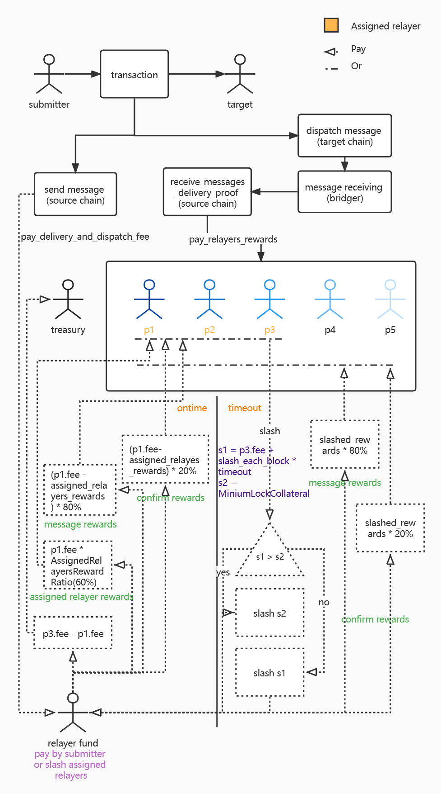

Fee Market Strategy
===

## Relay strategy

In Darwinia <> Crab and Pangolin <> Pangoro bridge. All relayers can decide
whether to relay a transaction. Decide on your role (Assigned Relayer or Not
Assigned Relayer). Different roles will have different benefits.

You can refer to this picture:



So if you have good ideas, you can modify it yourself.

- `darwinia`: [feemarket.rs](../bridges/darwinia-crab/client-darwinia/src/feemarket.rs)
- `crab`: [feemarket.rs](../bridges/darwinia-crab/client-crab/src/feemarket.rs)

- `pangolin`: [feemarket.rs](../bridges/pangolin-pangoro/client-pangolin/src/feemarket.rs)
- `pangoro`: [feemarket.rs](../bridges/pangolin-pangoro/client-pangoro/src/feemarket.rs)

## Fee strategy

In addition, All relayers can also modify fee strategy to automatically update
your expected handling fees. We provided two templates.

- crazy
- reasonable

### Crazy

In this mode, Every time you find that the first one in Assigned relayers is not
yourself, you will quote the other party's price -1.

### Reasonable

Query the real fee use [Subscan](https://subscan.io) and query the exchange rate
of both chains. Get an appropriate price based on this.

### Custom

If you want to use different strategy, follow these steps (Take pangolin as an example):

1. Write your strategy to [src/fee/strategy](../bridges/pangolin-pangoro/bridge/src/fee/strategy)
2. Expose your strategy in [mod.rs](../bridges/pangolin-pangoro/bridge/src/fee/strategy/mod.rs)
3. Add your strategy to
   config [config.rs@UpdateFeeStrategyType](../bridges/pangolin-pangoro/bridge/src/bridge/config.rs)
4. Call your strategy in [fee.rs](../bridges/pangolin-pangoro/bridge/src/service/fee.rs)
5. Don't forget change your config file to use your strategy.

   ```toml
   [task]
   # 1800 seconds, 30 minutes
   interval_update_fee = 1800
   update_fee_strategy = "YourStrategy"
   ```
