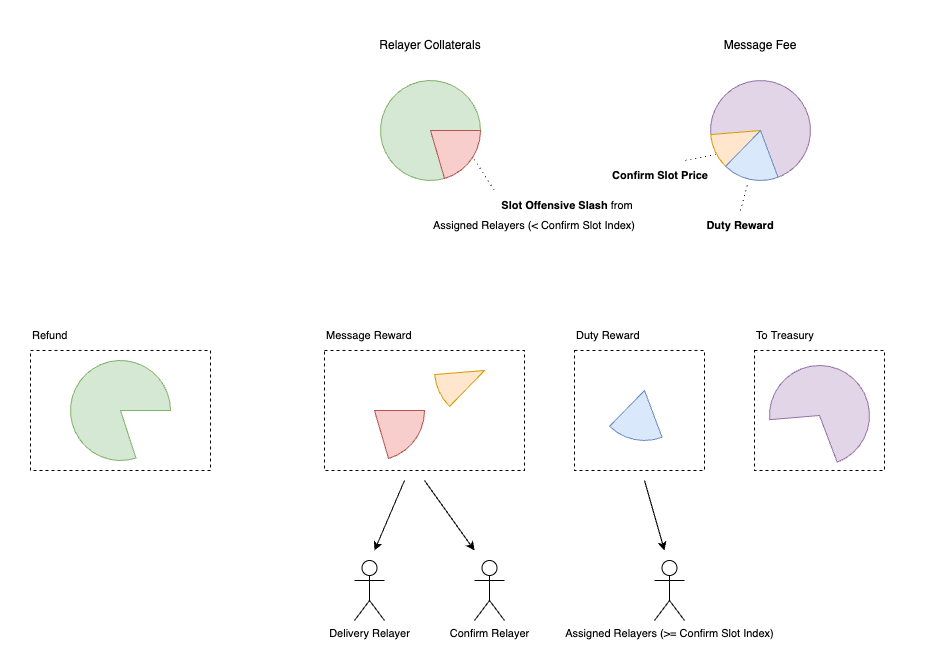
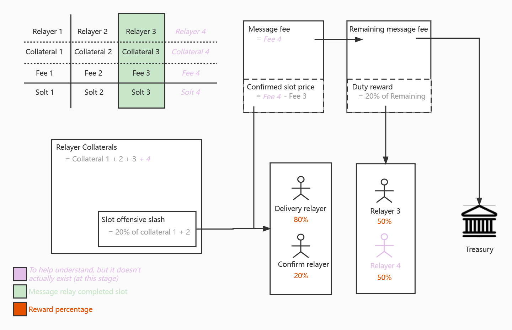

Fee Market Strategy
===

## Relay strategy

For s2s bridge (such as Darwinia<>Crab). All relayers can decide whether to
relay a transaction. Decide on your role (Assigned Relayer or Not Assigned
Relayer). Different roles will have different benefits.

You can refer to this picture:

|       Title       |                                      Image                                       |
|:-----------------:|:--------------------------------------------------------------------------------:|
| Rewards Pie Chart |  |
|  Reward Process   |  |

The more details you can
read [What Can A Cross-Chain Message Relayer Earn?](https://medium.com/darwinianetwork/what-can-a-cross-chain-message-relayer-get-ffb683b689cb)

So if you have good ideas, you can modify it yourself.

1. Create your strategy
   in [feemarket-s2s](../frame/assistants/feemarket-s2s/src/relay)
   reference [Basic strategy](../frame/assistants/feemarket-s2s/src/relay/basic.rs)
2. Replace strategy from message relay endpoint
  - [Crab > Darwinia](../bridges/darwinia-crab/bridge/src/service/message/crab_to_darwinia.rs#L100)
  - [Darwinia > Crab](../bridges/darwinia-crab/bridge/src/service/message/darwinia_to_crab.rs#L100)

## Fee strategy

In the future, we will support custom config to set feemarket strategy, so you
don't need to change code. but now. if you want to change strategy you need
change it from code and compile bridger.

